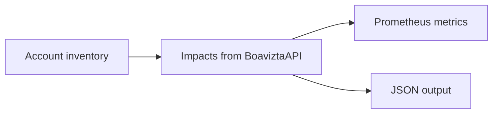

    

<h3 align="center">
    Boavizta's Cloud-scanner returns <i>environmental impacts</i> of your AWS Instances (EC2) usage.
</h3>

---

Cloud scanner combines real time _inventory_ and _usage_ data from your AWS account with [Boavizta API](https://github.com/Boavizta/boaviztapi/) to offer a  view of your impacts on a given region.

- multi criteria: Primary Energy consumption (PE), Abiotic resource depletion potential (ADP), and Global Warming Potential (GWP)
- multi stage: separate impacts of resources Usage and Manufacture

This is similar to what you can get from [Datavizta](http://datavizta.boavizta.org/cloudimpact) but with automated inventory.

Estimations can be filtered by tags. It eases attribution to a specific server, environment, application or service.

Cloud-scanner can be used:

- from command line, to get an immediate view of your impacts 💻
- as a metric server . You can use it to monitor and display real time impacts in a dashboard 📊

How it works:

Cloud scanner follows Boavizta approach.

> Thibault Simon, David Ekchajzer, Adrien Berthelot, Eric Fourboul, Samuel Rince, et al.. BoaviztAPI: a bottom-up model to assess the environmental impacts of cloud services. HotCarbon'24. Workshop on Sustainable Computer Systems, Jul 2024, Santa Cruz, United States. [⟨hal-04621947v1⟩](https://hal.science/hal-04621947v1)

## Usage and documentation

The complete documentation: [Introduction - Boavizta cloud scanner 📡](https://boavizta.github.io/cloud-scanner/).

## Getting started 🚀

- [Quickstart - dashboard using docker 🐳 - Boavizta cloud scanner 📡](https://boavizta.github.io/cloud-scanner/tutorials/quickstart-dashboard-docker.html)
- [Quickstart - using CLI docker 🐳 - Boavizta cloud scanner 📡](https://boavizta.github.io/cloud-scanner/tutorials/quickstart-docker.html)

## Deployment  as a serverless app (aws lambda) ⚡

Cloud scanner can also be deployed as a serverless application for aws.

- [Quickstart as serverless ⚡ - Boavizta cloud scanner 📡](https://boavizta.github.io/cloud-scanner/tutorials/quickstart-serverless.html)
- [Serverless design - Boavizta cloud scanner 📡](https://boavizta.github.io/cloud-scanner/reference/serverless-design.html)

## Output formats

Cloud scanner returns data as _json_ or _Open Metrics_ (Prometheus) format.

See [Output data - Boavizta cloud scanner 📡](https://boavizta.github.io/cloud-scanner/reference/output-data.html)

## ⚠  Perimeter / scope and limits

Cloud scanner _only_ estimates the impacts of your AWS EC2  instances and optionally block storage.

The limitations of cloud-scanner are documented in [Limitations - Boavizta cloud scanner 📡](https://boavizta.github.io/cloud-scanner/reference/limits.html)

