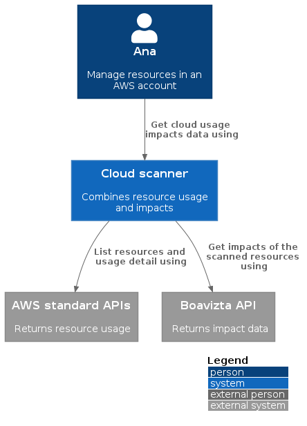

# cloud-scanner

Collect aws cloud usage data, so that it can be combined with impact data of Boavizta API.

⚠ Early Work in progress !

At the moment it just returns _standard_ impacts of aws instances in the default region of your account. It does not use metrics of instance usage to calculate the impacts, but rather returns the _default_ impact data provided by Boavizta API for each instance type for a given use duration.



## Getting started

### List standard impacts of AWS instances for 10 hours of use

Using default account region.

```sh
export AWS_PROFILE='<YOUR_PROFILE_NAME>'

# Estimate impact for 10 hours of use 
cargo run standard --hours-use-time 10 | jq
```

## Usage

### Run local docker image

```sh
docker build . --tag cloud-scanner-cli
# Test 
docker run cloud-scanner-cli
```

### Building local executable

```sh
cargo build --release
```

### Cli options

```sh
cargo run -- --help

List aws instances and their environmental impact (from Boavizta API)

USAGE:
    cloud-scanner-cli [OPTIONS] <SUBCOMMAND>

OPTIONS:
    -a, --aws-region <AWS_REGION>
            AWS region (default profile region is assumed if not provided)

    -b, --boavizta-api-url <BOAVIZTA_API_URL>
            Boavizta API URL

    -h, --help
            Print help information

    -o, --out-file <OUT_FILE>
            Save results to a file (instead of printing json to stdout)

    -t, --filter-tags <FILTER_TAGS>
            Filter instances on tags (like tag-key-1=val_1 tag-key_2=val2)

    -v, --verbosity
            Enable logging, use multiple `v`s to increase verbosity

    -V, --version
            Print version information

SUBCOMMANDS:
    help              Print this message or the help of the given subcommand(s)
    list-instances    just list instances and their metadata (without impacts)
    measured          get impacts related to measured instance usage: depending on usage rate
                          (use instance workload),
    standard          get Average (standard) impacts for a given usage duration
```

### Get measured impacts of instances for a given period

This uses the workload measured on instances to provide more realistic impacts.

⚠ TODO

- pass period parameter (start date / end date)
- define a sampling rate for cloudwatch metrics retrieval?

### Passing AWS credentials

Easiest way to pass aws credential is use an environment variable to use a specific aws profile.

```sh
export AWS_PROFILE='<YOUR_PROFILE_NAME>'
```

## Output format

Cloud scanner returns a json array of instances metadata (instance_id, type usage_data and and usage impacts) on _stdout_.

⚠ Returns _empty_ impacts when the _instance type_ is not known in Boavizta database

```json
[
  {
    "instance_id": "i-001dc0ebbf9cb25c0",
    "instance_type": "t2.micro",
    "usage_data": {
      "hours_use_time": 5,
      "usage_location": "IRL"
    },
    "impacts": {}
  },
  {
    "instance_id": "i-004599844f7c24814",
    "instance_type": "t2.small",
    "usage_data": {
      "hours_use_time": 5,
      "usage_location": "IRL"
    },
    "impacts": {}
  },
  {
    "instance_id": "i-075444d7293d8bd76",
    "instance_type": "t2.micro",
    "usage_data": {
      "hours_use_time": 5,
      "usage_location": "IRL"
    },
    "impacts": {}
  },
  {
    "instance_id": "i-033df52f12f30ca66",
    "instance_type": "m6g.xlarge",
    "usage_data": {
      "hours_use_time": 5,
      "usage_location": "IRL"
    },
    "impacts": {
      "adp": {
        "manufacture": 0.0084,
        "unit": "kgSbeq",
        "use": 1.7e-09
      },
      "gwp": {
        "manufacture": 87,
        "unit": "kgCO2eq",
        "use": 0.029
      },
      "pe": {
        "manufacture": 1100,
        "unit": "MJ",
        "use": 0.82
      }
    }
  }
]

```

## ⚠ Current limitations

- Return empty impacts when the instance _type_ is not listed in Boavizta database.
- Query only the _default region_ of you AWS profile (`--aws-region` flag is not yet implemented).
- Always returns _standard_ impacts: using instance workload to assess impact is not yet implemented (i.e. using CPU load through the `measured` command has no effect).
- Filtering instances by tag is not yet supported.

### Generate / update Boavizta API sdk

```sh
docker run --rm -v "${PWD}:/local" openapitools/openapi-generator-cli generate -i http://api.boavizta.org/openapi.json   -g rust  -o /local/boavizta-api-sdk --package-name boavizta_api_sdk
```
