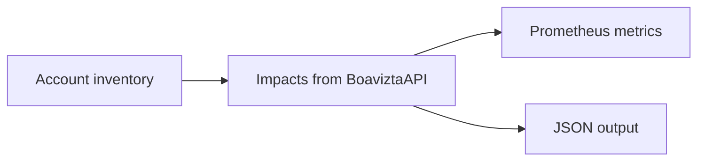

    

<h3 align="center">
    Boavizta's Cloud-scanner returns <i>environmental impacts</i> of your AWS Instances (EC2) usage.
</h3>

---

It combines real time _inventory_ and _usage_ data from your AWS account with [Boavizta API](https://github.com/Boavizta/boaviztapi/) to offer a  view of your impacts on a given region.

- multi criteria: Primary Energy consumption (PE), Abiotic resource depletion potential (ADP), and Global Warming Potential (GWP)
- multi stage: separate impacts of ressources Usage and Manufacture

This is similar to what you can get from [Datavizta](http://datavizta.boavizta.org/cloudimpact) but with automated inventory.

Estimations can be filtered by tags. It eases attribution to a specific server, environment, application or service.

Cloud-scanner can be used:

- from command line, to get an immediate view of your impacts 💻
- as a metric server . You can use it to monitor and display real time impacts in a dashboard 📊

How it works:

## Usage and documentation

The complete documentation: [Introduction - Boavizta cloud scanner 📡](https://boavizta.github.io/cloud-scanner/).

## Getting started 🚀

- [Quickstart - dashboard using docker 🐳 - Boavizta cloud scanner 📡](https://boavizta.github.io/cloud-scanner/tutorials/quickstart-dashboard-docker.html)
- [Quickstart - using CLI docker 🐳 - Boavizta cloud scanner 📡](https://boavizta.github.io/cloud-scanner/tutorials/quickstart-docker.html)

## Deployment  as a serverless app (aws lambda) ⚡

Cloud scanner can also be deployed as a serverless application for aws.

- [Quickstart as serverless ⚡ - Boavizta cloud scanner 📡](https://boavizta.github.io/cloud-scanner/tutorials/quickstart-serverless.html)
- [Serverless design - Boavizta cloud scanner 📡](https://boavizta.github.io/cloud-scanner/reference/serverless-design.html)

## Output formats

Cloud scanner CLI and serverless application returns data as _json_ or _Open Metrics_ (Prometheus) format.

See [Output data - Boavizta cloud scanner 📡](https://boavizta.github.io/cloud-scanner/reference/output-data.html)

## ⚠  Perimeter / scope and limits

Cloud scanner _only_ estimates the impacts of your AWS EC2  instances.

The limitations of cloud-scanner are documented in [Limitations - Boavizta cloud scanner 📡](https://boavizta.github.io/cloud-scanner/reference/limits.html)

Several significant aspects of the global impacts of cloud usage are **excluded**:

- only measure _compute_ instances (EC2 VM's)
- do not account for the surrounding cloud infrastructure (network, control plan)
- do not account for storage
- do not take into account the _overcommit_ (mutualization) or _overprovisionning_ that cloud provider may apply to provide the service.
- do not account managed services (like DB as a service or Containers as a service).
- do not account serverless (lambda) compute.
- supported regions (EU and US only for the time being)
- unsupported instance types returns zero for their impacts.
- we do not provide (yet) error margins <https://github.com/Boavizta/boaviztapi/issues/147>
- the manufacturing impacts are not amortized (i.e. values returned for manufacturing impacts do not consider usage duration).

This is work in progress, and development version may already implement theses functionalities. So have a look at the [changelog](https://github.com/Boavizta/cloud-scanner/blob/main/CHANGELOG.md) and [Issues · Boavizta/cloud-scanner](https://github.com/Boavizta/cloud-scanner/issues) on this repository or check the content of the `dev` branch.
