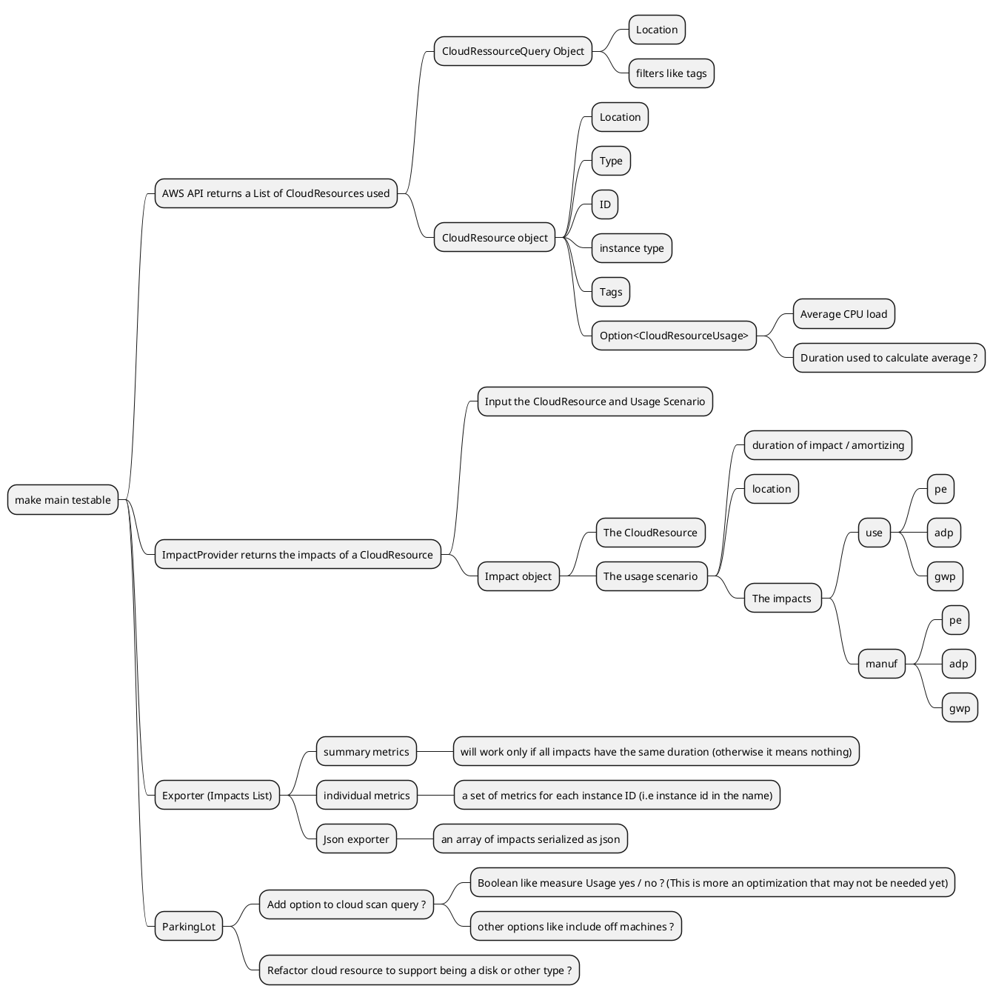

# Refactoring Cloud scanner

Objective is to make code more testable / isolate the domain objects from the API definitions and allow testing in isolation

```plantuml
@startmindmap
* make main testable
  * AWS API returns a List of CloudResources used
    * CloudRessourceQuery Object
      * Location
      * filters like tags
    * CloudResource object
      * Location
      * Type
      * ID
      * instance type
      * Tags
      * Option<CloudResourceUsage>
        * Average CPU load
        * Duration used to calculate average ?
  * ImpactProvider returns the impacts of a CloudResource
    * Input the CloudResource and Usage Scenario
    * Impact object
      * The CloudResource
      *  The usage scenario 
        * duration of impact / amortizing
        * location
        * The impacts 
          * use
            * pe
            * adp
            * gwp
          * manuf
            * pe
            * adp
            * gwp
  * Exporter (Impacts List)
    * summary metrics
      * will work only if all impacts have the same duration (otherwise it means nothing)
    * individual metrics
      * a set of metrics for each instance ID (i.e instance id in the name)
    * Json exporter
      * an array of impacts serialized as json
  * ParkingLot
    * Add option to cloud scan query ?
      * Boolean like measure Usage yes / no ? (This is more an optimization that may not be needed yet)
      * other options like include off machines ?
    * Refactor cloud resource to support being a disk or other type ?


@endmindmap
```
