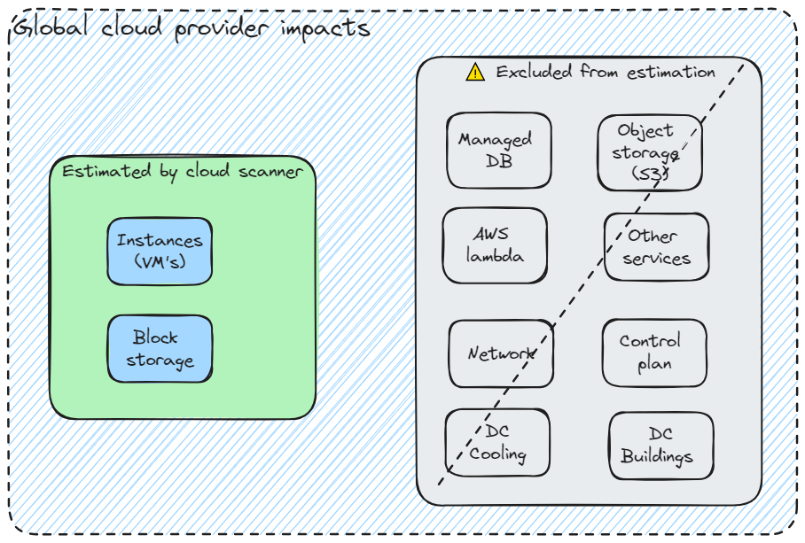

# Methodology and source of data

Cloud scanner relies on the Boavizta methodology and data to estimate the impacts of cloud resources.

It performs an inventory of the resources used in a cloud account. It then returns impacts of the *use* phase but also impacts related to the *manufacture* of the identified resources (*embodied* impacts).

## The source of impact data

Impact data is retrieved from [BOAVIZTA reference data API](https://github.com/Boavizta/boaviztapi/) v1.2.x.

## General approach and limits

Cloud scanner estimates impacts according to the duration of use of cloud resources. It also considers the "intensity" of use (like the type of instance and CPU load for a VM or size of a disk for storage). The region of use is also considered to take into account the electricity mix of the region (carbon intensity).

The general approach is to map cloud vendor specific ressources, either to Boavizta *cloud resources* (like for VM instances) or to more generic components (Block storage volumes are approximated as Boavizta HDD or SSD).

But this approach means that **a large portion** of the cloud provider infrastructure **is excluded from the estimation**.

⚠ Cloud scanner **underestimates the impacts of a cloud account**. Because it only considers the _instances_ and _block storage_, many additional sources of impacts (network, potential redundancy, cloud control plan, buildings...) are not included in the estimation.

See also [other limits](../reference/limits.md).

## Methodology

The Boavizta methodology is described in [Digital &amp; environment : How to evaluate server manufacturing footprint, beyond greenhouse gas emissions? | Boavizta](https://boavizta.org/en/blog/empreinte-de-la-fabrication-d-un-serveur)

The impacts (use and embedded) are attributed according to the principles described in [Cloud instances - Boavizta API documentation](https://doc.api.boavizta.org/Explanations/services/cloud/).

The results of cloud scanner are similar to what you can visualize in [Datavizta](http://datavizta.boavizta.org/cloudimpact), but with automated inventory.

- Boavizta website: <https://www.boavizta.org/en>

