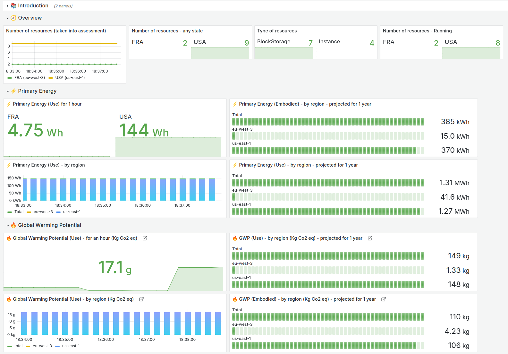

# About cloud-scanner

Cloud-scanner returns environmental impacts of your AWS Cloud usage. It combines Boavizta data and metadata of your AWS cloud account to offer a global view of your impacts on a given region.

You can use cloud-scanner it in 2 different ways:

- from command line 💻
- deployed as a serverless application using AWS lambda ⚡

Cloud-scanner analyses your EC2 instances and returns metrics using the [Boavizta API](https://github.com/Boavizta/boaviztapi/). These metrics can easily be scrapped by prometheus and displayed in a dashboard.

## ⚠ Alpha version

Cloud scanner is stable, but with limited functionality.

At the moment it only returns _standard_ impacts of AWS instances. It does not yet analyses instance usage (workload) to calculate the impacts, but rather returns the _default_ impact data provided by Boavizta API for each instance type for a fixed duration of use.

This is a work in progress ! See the [changelog](https://github.com/Boavizta/cloud-scanner/blob/main/CHANGELOG.md).
