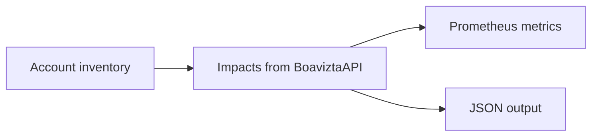

# About cloud-scanner

[Boavizta Cloud-scanner](https://github.com/Boavizta/cloud-scanner) returns environmental impacts of your AWS Instances (EC2) and Storage usage.

It combines real time _inventory_ and _usage_ data from your AWS account with [Boavizta API](https://github.com/Boavizta/boaviztapi/) to offer a  view of your impacts on a given region.

- multi criteria: Primary Energy consumption (PE), Abiotic resource depletion potential (ADP), and Global Warming Potential (GWP)
- multi stage: separate impacts of ressources Usage and Manufacture

Estimations can be filtered by tags. It eases attribution to a specific server, environment, application or service.

Cloud-scanner can be used:

- from command line, to get an immediate view of your impacts 💻
- as a metric server . You can use it to monitor and display real time impacts in a dashboard 📊

Cloud-scanner is an Open Source application maintained here: <https://github.com/Boavizta/cloud-scanner>.

## How it works

Cloud scanner relies on cloud providers APIs to perform an inventory of your cloud resources.  It collects information about usage (instance types, tags, CPU load or volume size).

This inventory is used to query Boavizta API which returns impact data.

Results are exposed as JSON or metrics.

## Contributing

Cloud scanner is stable, but with limited functionality.

Development versions may already provide new functionalities that have not yet be included to a release. So have a look at the [changelog](https://github.com/Boavizta/cloud-scanner/blob/main/CHANGELOG.md) and [Issues](https://github.com/Boavizta/cloud-scanner/issues) on this repository.

And most importantly, do not hesitate to ask questions or share your feedback by opening an [Issue](https://github.com/Boavizta/cloud-scanner/issues) or [discussion](https://github.com/Boavizta/cloud-scanner/discussions) on GitHub.
