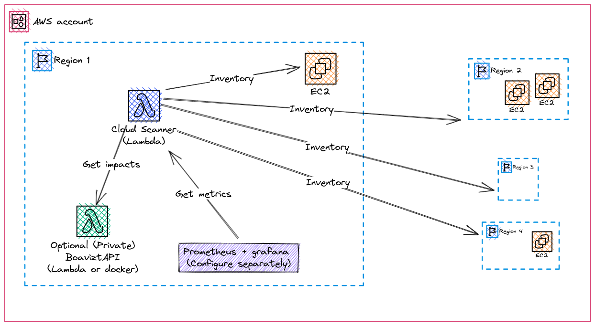

# Serverless design

We use the [serverless framework](https://www.serverless.com/) and the [softprops/serverless-rust](https://github.com/softprops/serverless-rust) plugin to ease packaging and deployment as lambda.

The cloud-scanner-cli is wrapped into a set of lambdas functions exposed behind an AWS API gateway.

_This is certainly not the only way to deploy the application. If you want more control, you could compile, package and deploy the application with Terraform or CDK, but this is not documented yet._

## Serverless deployment

When deploying as serverless, **you** have to provide and configure Grafana and Prometheus seprately. This repository _only_ wrapps the cloud-scanner in a lambda.

The recommended serveless deployment is the following.



The scanner is deployed as a lambda inside a first region of your account. It performs inventory of other regions. 

- You may restrict to specifc regions by tuning the role of the lambda defined in `serverless.yml`
- You can (and should) also deploy Boaviztapi as a lambda or other in your account. This allow to perform scans and evaluate impacts without any inventory data leaking outside your account. Once you have deployed your own instance of BoaviztAPI, tune the `BOAVIZTA_API_URL` in the `serverless.yml` file to ensure that cloud-scanner points to your private instance of API. See  [using private Boavizta API](../tutorials/../how-to/using-private-boaviztapi.md).

⚠ Open issue prevents Boavizta API deployment as Lambda (https://github.com/Boavizta/boaviztapi/issues/153). As a workaround we recommend deploying Boavizta API as a docker container  (for example using AWS ECS) . You can still use cloud-scanner itself as serverless application deployed with Lambda.

## Serverless routes

### Instance impacts as JSON

The `scan` route returns individual instances metrics in json format (see below, same as CLI)

Use `hours_use_time` and `aws_region` parameters in the query

E.g.: `https://xxxxx.execute-api.eu-west-1.amazonaws.com/dev/scan?hours_use_time=5&aws_region=eu-west-1`

```json
[
  {
    "instance_id": "i-03c8f84a6318a8186",
    "instance_type": "a1.medium",
    "usage_data": {
      "hours_use_time": 5,
      "time_workload": 0,
      "usage_location": "IRL"
    },
    "impacts": {
      "adp": {
        "manufacture": 0.0063,
        "unit": "kgSbeq",
        "use": 8e-12
      },
      "gwp": {
        "manufacture": 31,
        "unit": "kgCO2eq",
        "use": 0.0001
      },
      "pe": {
        "manufacture": 430,
        "unit": "MJ",
        "use": 0.004
      }
    }
  },
  {
    "instance_id": "i-033df52f12f30ca66",
    "instance_type": "m6g.xlarge",
    "usage_data": {
      "hours_use_time": 5,
      "time_workload": 0,
      "usage_location": "IRL"
    },
    "impacts": {
      "adp": {
        "manufacture": 0.0083,
        "unit": "kgSbeq",
        "use": 8e-10
      },
      "gwp": {
        "manufacture": 83,
        "unit": "kgCO2eq",
        "use": 0.01
      },
      "pe": {
        "manufacture": 1100,
        "unit": "MJ",
        "use": 0.4
      }
    }
  },
  {
    "instance_id": "i-0a3e6b8cdb50c49b8",
    "instance_type": "c5n.xlarge",
    "usage_data": {
      "hours_use_time": 5,
      "time_workload": 0,
      "usage_location": "IRL"
    },
    "impacts": {
      "adp": {
        "manufacture": 0.0086,
        "unit": "kgSbeq",
        "use": 1e-9
      },
      "gwp": {
        "manufacture": 64,
        "unit": "kgCO2eq",
        "use": 0.02
      },
      "pe": {
        "manufacture": 840,
        "unit": "MJ",
        "use": 0.5
      }
    }
  },
  {
    "instance_id": "i-003ea8da7bb9bfff9",
    "instance_type": "m6g.xlarge",
    "usage_data": {
      "hours_use_time": 5,
      "time_workload": 0,
      "usage_location": "IRL"
    },
    "impacts": {
      "adp": {
        "manufacture": 0.0083,
        "unit": "kgSbeq",
        "use": 8e-10
      },
      "gwp": {
        "manufacture": 83,
        "unit": "kgCO2eq",
        "use": 0.01
      },
      "pe": {
        "manufacture": 1100,
        "unit": "MJ",
        "use": 0.4
      }
    }
  }
]
```

### Account impacts as metrics

The `metrics` route returns aggregated account metrics _for one hour of use_ in Prometheus format.

Use `aws_region` parameters in the query.

E.g.: `https://xxxxx.execute-api.eu-west-1.amazonaws.com/dev/metrics?aws_region=eu-central-1`

```text
# HELP boavizta_number_of_instances_total Number of instances detected during the scan.
# TYPE boavizta_number_of_instances_total gauge
boavizta_number_of_instances_total{awsregion="eu-central-1",country="DEU"} 7
# HELP boavizta_number_of_instances_assessed Number of instances that were considered in the measure.
# TYPE boavizta_number_of_instances_assessed gauge
boavizta_number_of_instances_assessed{awsregion="eu-central-1",country="DEU"} 5
# HELP boavizta_duration_of_use_hours Number of instances detected during the scan.
# TYPE boavizta_duration_of_use_hours gauge
boavizta_duration_of_use_hours{awsregion="eu-central-1",country="DEU"} 1.0
# HELP boavizta_pe_manufacture_megajoules Power consumed for manufacture.
# TYPE boavizta_pe_manufacture_megajoules gauge
boavizta_pe_manufacture_megajoules{awsregion="eu-central-1",country="DEU"} 1760.0
# HELP boavizta_pe_use_megajoules Power consumed during usage.
# TYPE boavizta_pe_use_megajoules gauge
boavizta_pe_use_megajoules{awsregion="eu-central-1",country="DEU"} 0.86
# EOF
```

See also [Set up monitoring dashboard](../how-to/set-up-dashboard.md) for an example of scrapping and displaying these metrics.
