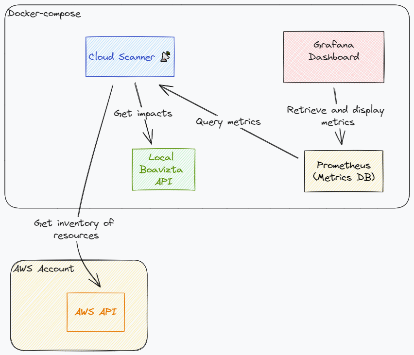

# Quick start : display dashboard using docker-compose 🐳

Visualize the live impacts of you account in a dashboard.

No installation needed, you will run a public docker image of cloud-scanner CLI, Boavizta API, Prometheus and Grafana to get access to a demo dashboard..

All data remain  local to your environment (this docker-compose stack uses a _private instance_ of Boavizta API).

## Pre-requisites

- Docker and docker-compose
- A working AWS account (and your AWS CLI profile already configured)



## Run the demo dashboard

```sh
# Map your AWS credentials
export AWS_PROFILE=name-of-your-profile
# Start the stack (from the root of the repository)
docker-compose up
```

- Demo dashboard is exposed on http://localhost:3001 
- Log in with user admin/admin
- Select the dashboard in the left menu.


⚠ The demo docker-compose is preconfigured to generate metrics only for the following regions:
- eu-west-1
- eu-west-3
- eu-central-1
- us-east-1 

Refer to  [Generating metrics for additional regions](../how-to/set-up-dashboard.md#generating-metrics-for-additional-regions) to retrieve metrics for additional regions.

## Additional info

- ⚠ This docker-compose example is **not** intended  for production deployment, but rather for quick testing.
  - ports of all services are exposed.
  - Grafana is served on http with default login.
- You may have to update the line mapping your AWS profile (Replace `AWS_PROFILE=${AWS_PROFILE}` by `AWS_PROFILE=the-real-name-of-your-profile`) when using Podman. It seems that Podman compose does not map the variables of the environment to the containers.
- In corporate environments, you may need to provide your certificates authorities certificates (`ca-certificates`) to the cloud-scanner container (uncomment the mapping line in the docker-compose file).
- For the demo, we deliberately set a short metrics scrapping interval (30 seconds). In a production environment, you may want to increase this metric scraping interval to reduce the API calls and volume of data. This scrapping period is set in the Prometheus configuration file.
